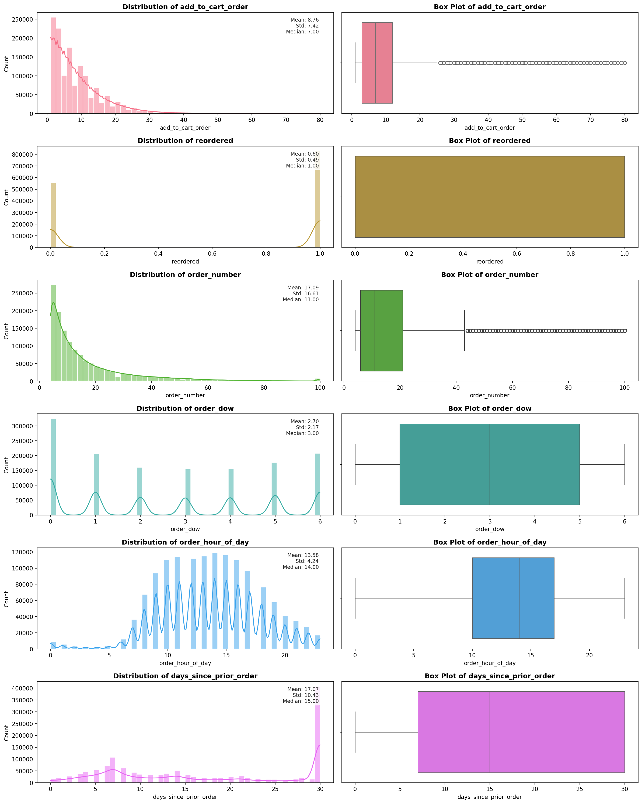
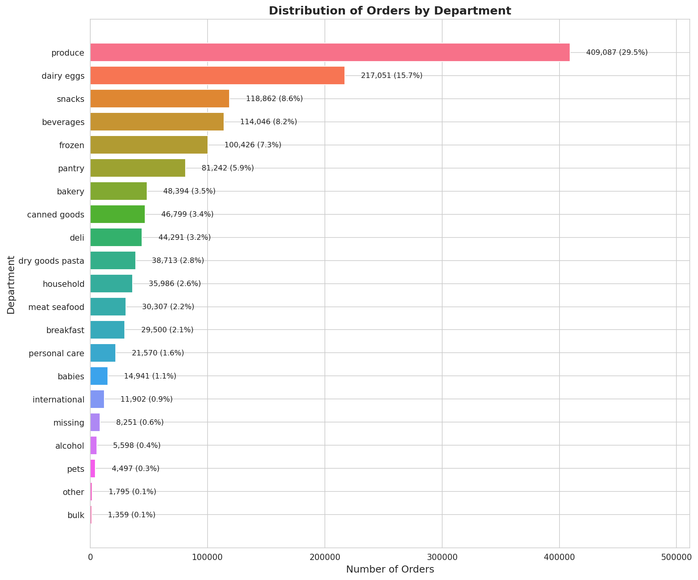
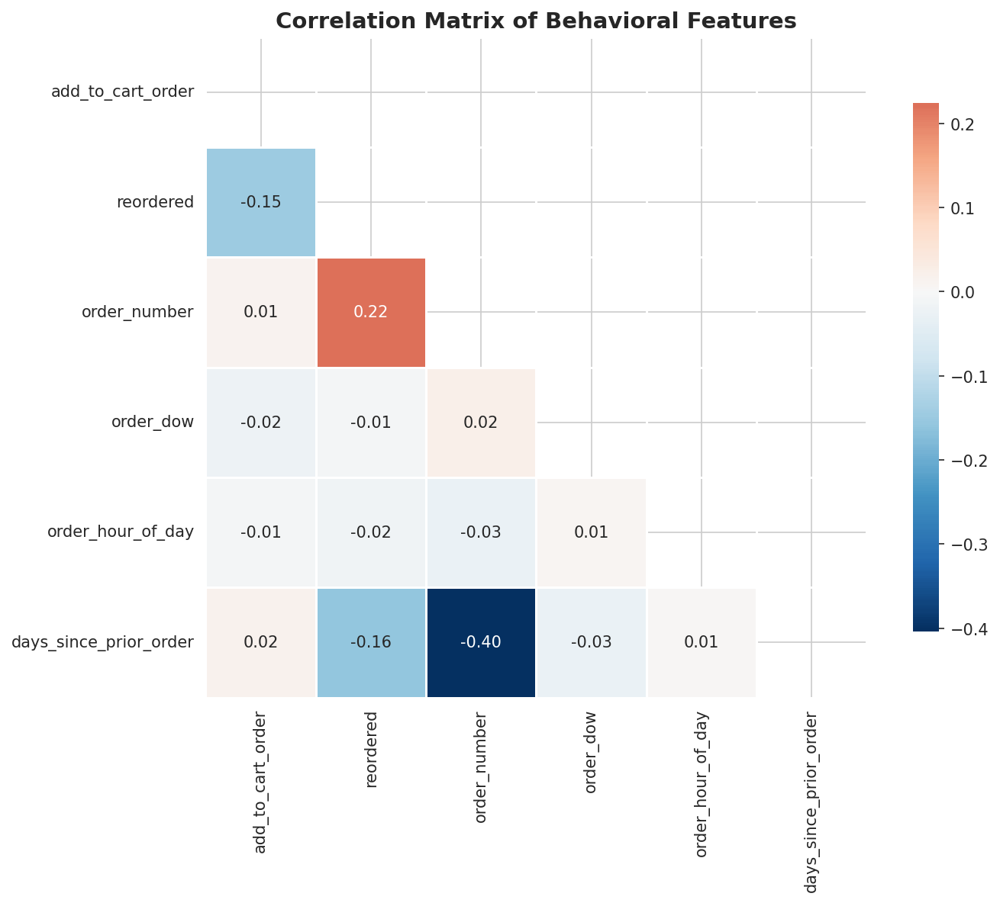

# 📊 สรุป Insights เบื้องต้น - Instacart Customer Segmentation

## 1. ภาพรวมของข้อมูล

| รายการ | ค่า |
|--------|-----|
| จำนวนแถว | 1,384,617 |
| จำนวนคอลัมน์ | 15 |
| Missing Values | 0 (ไม่มีข้อมูลขาดหาย) |
| ช่วงเวลาข้อมูล | ข้อมูลการสั่งซื้อย้อนหลัง (prior orders) |

### คอลัมน์ในข้อมูล
- **ID columns**: order_id, product_id, user_id, aisle_id, department_id
- **Order info**: order_number, order_dow, order_hour_of_day, days_since_prior_order
- **Product info**: product_name, aisle, department
- **Behavioral**: add_to_cart_order, reordered, eval_set

---

## 2. การกระจายของ Numeric Features

### 2.1 add_to_cart_order (ลำดับการเพิ่มสินค้าลงตะกร้า)
- **Mean**: 8.76, **Median**: 7, **Std**: 7.42
- **Range**: 1 - 80
- **การกระจาย**: Right-skewed (เบ้ขวา) — ลูกค้าส่วนใหญ่เพิ่มสินค้าในลำดับต้นๆ ของตะกร้า
- **Insight**: ลูกค้าส่วนใหญ่ซื้อสินค้า < 15 ชิ้นต่อออเดอร์

### 2.2 reordered (การซื้อซ้ำ)
- **Mean**: 0.60 (60% เป็นการซื้อซ้ำ)
- **การกระจาย**: Binary (0 หรือ 1)
- **Insight**: ลูกค้า Instacart มีพฤติกรรมซื้อซ้ำสูง — สะท้อนความจงรักภักดีต่อสินค้าที่ชอบ

### 2.3 order_number (ลำดับออเดอร์ของลูกค้า)
- **Mean**: 17.09, **Median**: 11, **Std**: 16.61
- **Range**: 4 - 100
- **การกระจาย**: Right-skewed อย่างมาก — มี outliers 7.92%
- **Insight**: ลูกค้าส่วนใหญ่มีประวัติ 4-20 ออเดอร์ แต่มีกลุ่ม heavy users ที่สั่งถึง 100 ครั้ง

### 2.4 order_dow (วันในสัปดาห์)
- **Mean**: 2.70, **Range**: 0-6 (0 = วันอาทิตย์)
- **การกระจาย**: ค่อนข้างกระจายสม่ำเสมอ
- **Insight**: ลูกค้าสั่งซื้อทุกวัน แต่มีแนวโน้มสั่งในวันต้นสัปดาห์ (0-2) มากกว่า

### 2.5 order_hour_of_day (ชั่วโมงที่สั่งซื้อ)
- **Mean**: 13.58, **Median**: 14
- **Range**: 0-23
- **การกระจาย**: ใกล้เคียง normal distribution มี peak ที่ช่วง 10:00-16:00
- **Insight**: ช่วงเวลายอดนิยมคือกลางวันถึงบ่าย (10.00-16.00 น.)

### 2.6 days_since_prior_order (จำนวนวันตั้งแต่สั่งครั้งก่อน)
- **Mean**: 17.07, **Median**: 15, **Std**: 10.43
- **Range**: 0-30 (ถูก cap ที่ 30 วัน)
- **การกระจาย**: Bimodal — มี peak ที่ 7 วัน และ 30 วัน
- **Insight**: 
  - กลุ่ม weekly shoppers: สั่งทุก 7 วัน
  - กลุ่ม monthly shoppers: สั่งทุก 30 วัน หรือนานกว่านั้น

---

## 3. การกระจายของ Department (หมวดหมู่สินค้า)

### Top 5 Departments
| อันดับ | Department | จำนวน | สัดส่วน |
|--------|------------|--------|---------|
| 1 | produce (ผักผลไม้) | 409,087 | 29.5% |
| 2 | dairy eggs (นม/ไข่) | 217,051 | 15.7% |
| 3 | snacks (ขนมขบเคี้ยว) | 118,862 | 8.6% |
| 4 | beverages (เครื่องดื่ม) | 114,046 | 8.2% |
| 5 | frozen (อาหารแช่แข็ง) | 100,426 | 7.3% |

### Insights
- **Produce ครองตลาด**: เกือบ 30% ของการซื้อทั้งหมดเป็นผักผลไม้
- **Long-tail Distribution**: มี 21 departments แต่ Top 5 คิดเป็น ~69% ของยอดขายทั้งหมด
- **Department ที่น้อยที่สุด**: bulk (สินค้าเหมา), pets (สัตว์เลี้ยง), other

---

## 4. ความสัมพันธ์ระหว่าง Features (Correlation Analysis)

### Significant Correlations (|r| > 0.3)

| Feature 1 | Feature 2 | Correlation | ความหมาย |
|-----------|-----------|-------------|-----------|
| order_number | days_since_prior_order | **-0.404** | Negative correlation |

### การตีความ
- **order_number ↔ days_since_prior_order (-0.40)**:
  - ลูกค้าที่สั่งบ่อย (order_number สูง) มักมีช่วงห่างระหว่างออเดอร์สั้น
  - สะท้อนว่า heavy users มีพฤติกรรมการสั่งที่ถี่กว่า

- **ไม่พบ correlation ที่แรงกับ features อื่น** — แสดงว่า features ส่วนใหญ่ค่อนข้างเป็นอิสระต่อกัน ซึ่งดีสำหรับการนำไป clustering

---

## 5. ข้อเสนอแนะสำหรับการวิเคราะห์ต่อ

### 5.1 Feature Engineering
จากการวิเคราะห์ข้างต้น แนะนำให้สร้าง features เพิ่มเติม:

1. **User-level Aggregations**
   - `avg_basket_size`: ขนาดตะกร้าเฉลี่ยของลูกค้า
   - `reorder_ratio`: สัดส่วนการซื้อซ้ำของลูกค้า
   - `shopping_frequency`: ความถี่การสั่งซื้อ (1/avg_days_since_prior)

2. **Temporal Features**
   - `preferred_hour`: ชั่วโมงที่ลูกค้าชอบสั่ง
   - `preferred_dow`: วันที่ลูกค้าชอบสั่ง
   - `is_weekend_shopper`: เป็นนักช้อปวันหยุดหรือไม่

3. **Product Diversity**
   - `unique_departments`: จำนวน department ที่ลูกค้าซื้อ
   - `unique_aisles`: จำนวน aisle ที่ลูกค้าซื้อ
   - `dept_concentration`: ความเข้มข้นการซื้อใน department หลัก

### 5.2 Customer Segments ที่คาดว่าจะพบ
จากข้อมูลเบื้องต้น คาดว่าจะพบกลุ่มลูกค้าดังนี้:

1. **Heavy Weekly Shoppers**: สั่งบ่อย (ทุก 7 วัน), ตะกร้าใหญ่, ซื้อซ้ำสูง
2. **Monthly Stock-Up Shoppers**: สั่งห่าง (30 วัน), ตะกร้าใหญ่มาก
3. **Health-Conscious Shoppers**: ซื้อ produce สูง, ซื้อ snacks ต่ำ
4. **Convenience Seekers**: ซื้อ frozen/prepared foods สูง

### 5.3 Next Steps
1. รัน `customer_features.py` เพื่อสร้าง user-level features
2. ทำ clustering ด้วย K-Means (ทดลอง k = 3-6)
3. วิเคราะห์และตั้งชื่อ segments
4. สร้าง business recommendations

---

## 6. ไฟล์ที่สร้าง

| ไฟล์ | รายละเอียด |
|------|------------|
| `plots/numeric_distributions.png` | กราฟ histogram + boxplot ของ 6 numeric features |
| `plots/categorical_distributions.png` | Bar chart ของ 21 departments |
| `plots/correlation_matrix.png` | Heatmap แสดง correlation ระหว่าง features |

---

*สร้างโดยอัตโนมัติจาก `src/analysis/data_visualization.py`*
*วันที่: 11 กุมภาพันธ์ 2026*
